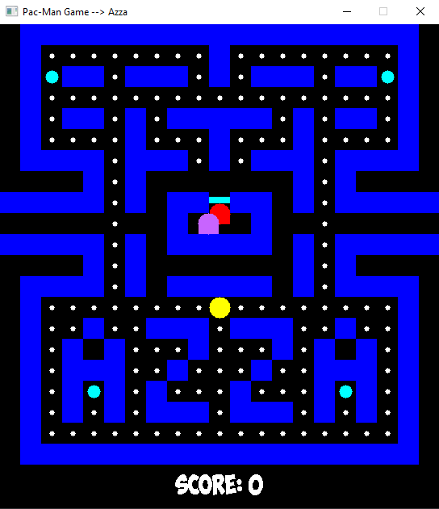

# Pac-Man Game

 This is the capstone project for Udacity C++ Nanodegree. The code was inspired by [this](https://github.com/Kofybrek/Pacman) creative game repo and [this](https://github.com/udacity/CppND-Capstone-Snake-Game) Udacity 2D Snake game repo. I also found good guidelines from [this](https://lazyfoo.net/tutorials/SDL/) game programming with SDL tutorials and Udacity C++ Nanodegree lessons (especially A* search algorithm).

In this project, I built my own C++ application from scratch following the principles I learned throughout the Nanodegree Program. I chose to make a simple version of the classic arcade game (Pac-Man). Pac-Man is controlled by the player who directs him throughout the maze to eat all the dots while avoiding the ghosts. If Pac-Man ate an energizer, the ghosts turn blue for a short while and Pac-Man can eat them during this period and earn bonus points. The player loses if the ghosts eat Pac-Man. To win this game: use arrow keys to move your character, Don't get caught, and eat all the dots on the ground.

## Dependencies for Running Locally
* cmake: version 3.26.4
  - All OSes: [click here for installation instructions](https://cmake.org/install/)
* SDL2: version 2.26.5
  - All installation instructions can be found [here](https://wiki.libsdl.org/Installation)
* gcc/g++: version 12.2.0
  - Windows: recommend using [MinGW](http://www.mingw.org/)
* IDE: Visual Studio 2019 Community Edition
  - Latest version can be found [here](https://visualstudio.microsoft.com/vs/community/)
* SDL_ttf Library: version 2.20.2
  - You can get it from [here](https://github.com/libsdl-org/SDL_ttf/releases)

## Basic Build Instructions
1. Clone this repo.
2. Open the Visual Studio Solution "Pac-Man.sln"
3. Make sure all the above-mentioned dependencies are set properly
4. Build the project (Ctrl + B)
5. Run the game (Ctrl + F5)

## Project Structure
* The source code consists of a main file called "Pac-Man.cpp" along with 4 other classes implemented in both .h and .cpp files.
  - Renderer files manages the GUI.
  - Game files controls the game flow.
  - Pacman files manages Pac-Man's movement and interactions.
  - Ghost files manages ghost's behaviour.
* Running this game excutes a game window with playground map and an external player controls for winning.

## Rubric Points Addressed
* The project demonstrates an understanding of C++ functions and control structures.
  - Functions:
    - File: Pac-Man.cpp ~ line: 8.
    - File: Renderer.h ~ lines: 21 -> 27.
    - File: Game.h ~ lines: 14 -> 17.
    - File: Pacman.h ~ lines: 16, 23 -> 27.
    - File: Ghost.h ~ lines: 22 -> 27.
  - Control structures:
    - File: Renderer.cpp ~ lines: 8, 11, 16, 19, 23, 29, 34, 75, 76, 77, 104, 105, 114, 121, 122, 123, 132, 133, 134, 163, 170, 182, 186, 217, 222, 255, 260.
    - File: Game.cpp ~ lines: 17, 20, 21, 29,, 30, 31, 35, 40, 44, 54, 67, 79, 80, 87, 89, 90, 93, 95, 100.
    - File: Pacman.cpp ~ lines: 14, 15, 16, 34, 36, 38, 40, 44, 52, 54.
    - File: Ghost.cpp ~ lines: 9, 10, 13, 17, 29, 30, 31, 41, 43, 46, 47, 49, 53, 55, 58, 67, 71, 77, 91, 92, 93, 96, 112, 126, 132, 133, 134, 145, 146, 148, 151, 152, 154, 169, 177, 179, 183, 194, 200, 206, 207, 216, 217, 226, 228, 233, 237, 243, 250, 253, 255, 256, 264, 271, 272.
* The project accepts user input and processes the input.
  - File: Pacman.cpp ~ lines: 32 -> 41.
* The project uses Object Oriented Programming techniques.
  - File: Renderer.h ~ lines: 19 -> 35.
  - File: Game.h ~ lines: 12 -> 27.
  - File: Pacman.h ~ lines: 13 -> 33.
  - File: Ghost.h ~ lines: 20 -> 44.
* Classes use appropriate access specifiers for class members.
  - File: Renderer.h ~ lines: 20, 29.
  - File: Game.h ~ lines: 13, 22.
  - File: Pacman.h ~ lines: 22, 29.
  - File: Ghost.h ~ lines: 21, 29.
* Class constructors utilize member initialization lists.
  - File: Renderer.cpp ~ lines: 5 -> 6.
  - File: Game.cpp ~ lines: 3 -> 4.
  - File: Pacman.cpp ~ line: 4.
  - File: Ghost.cpp ~ lines: 4 -> 6.
* Classes abstract implementation details from their interfaces.
  - File: Renderer.h ~ lines: 21 -> 27.
  - File: Game.h ~ lines: 14 -> 17.
  - File: Pacman.h ~ lines: 23 -> 27.
  - File: Ghost.h ~ lines: 22 -> 27.
* Classes encapsulate behavior.
  - File: Renderer.h ~ lines: 17, 19, 29.
  - File: Game.h ~ lines: 12, 22.
  - File: Pacman.h ~ lines: 21, 25, 27, 29.
  - File: Ghost.h ~ lines: 18, 20, 24, 27, 29.
* The project makes use of references in function declarations.
  - File: Renderer.h ~ lines: 23, 24, 26, 27.
  - File: Game.h ~ lines: 15, 16.
  - File: Pacman.h ~ lines: 16, 23, 26, 32.
  - File: Ghost.h ~ lines: 22, 25, 33.
* The project uses destructors appropriately.
  - File: Renderer.cpp ~ lines: 42 -> 45.